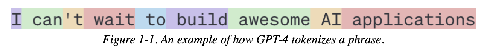

# AI Engineering Primer

Helix meetup Gold Coast 2025

## Demystifying AI Engineering

---

## AI Engineering?

Building applications on top of readily available models (a.k.a **foundation models**).

Understanding how foundation models work can help us identify the opportunities and challenges of **_adapting_** them to our needs.

---

## Language models

Encodes statistical information about one or more languages.

This information tells us how likely a word is to appear in a given context.

```
My favourite colour is _

```

A language model should predict `blue` more often than `car`.

---

## Tokens

The basic unit of a language model.

A character, a word, or a part of a word (like `-tion`).

The set of all tokens a model can work with is the model’s **_vocabulary_**.



---

## Sampling

To generate the next token, the model computes the probabilities of all tokens in the **_vocabulary_**.

Sampling refers to how the model chooses the next token.


---

## Greedy sampling

A common sampling strategy is to pick the outcome with the highest probability.

This works for classification, but creates _boring_ outputs.

Instead of picking the next most likely token, the model can sample according to the probability distributions of all possible values.


---

## Sampling: Logits

Each **_logit_** of a **_logit vector_** corresponds to a token from the model's **_vocabulary_**.

Larger logit values correspond to higher probabilities.


---

## Sampling: Logprobs

Short for log probabilities, represent the probabilities of each token in the log scale.

Higher logprob values (closer to zero) indicate greater certainty in a token’s selection.

Not all model providers expose logprobs.


---

## Sampling: Logprobs

Short for **_log probabilities_**, represent how likely each token is to be the next token in the sequence.

```ts
const prompt = `The unicorn's favourite colour is `
```

```json
{
  "token": "pink",
  "logprob": -0.15612991, // = 0.855 probability of pink
  "topLogprobs": [
    { "token": "pink", "logprob": -0.15612991 }, // = 0.855 probability of pink
    { "token": "spark", "logprob": -2.6561298 }, // = 0.070 probability of spark
    { "token": "rain", "logprob": -3.2811298 }, // = 0.037 probability of rain
    { "token": "purple", "logprob": -3.5311298 }, // = 0.031 probability of purple
    { "token": "blue", "logprob": -5.28113 } // = 0.005 probability of blue
  ]
}
```

Use `Math.exp()` to convert logprobs to probabilities (values between 0 and 1).

---

## Sampling strategies

## Temperature

Redistributes the probabilities of the possible values.

A higher temperature:

- 👇 reduces the probabilities of common tokens.
- 👆 increases the probabilities of rarer tokens.

This enables models to create more creative responses.

It’s common to set the temperature to 0 for a consistent output.

---

## Sampling strategies

### Top-k

Selects the top k logits before calculating the softmax.

👇 smaller k values make the text more predictable but less interesting.

```json
// Top-k = 3
[
  { "token": "pink", "logprob": -0.15612991 }, // ✅
  { "token": "spark", "logprob": -2.6561298 }, // ✅
  { "token": "rain", "logprob": -3.2811298 }, // ✅
  { "token": "purple", "logprob": -3.5311298 }, // ❌
  { "token": "blue", "logprob": -5.28113 } // ❌
]
```

---

## Sampling strategies

### Top-p (nucleus sampling)

Limits the set of tokens to those with the highest probability.

A top-p value of 0.9 means the model looks at words that together exceed 90% probability.

```json
// Top-p = 0.9
[
  { "token": "pink", "logprob": -0.15612991 }, // = 0.855 probability (cumulative = 0.855) ✅
  { "token": "spark", "logprob": -2.6561298 }, // = 0.070 probability (cumulative = 0.925) ✅
  { "token": "rain", "logprob": -3.2811298 }, // = 0.037 probability ❌
  { "token": "purple", "logprob": -3.5311298 }, // = 0.031 probability ❌
  { "token": "blue", "logprob": -5.28113 } // = 0.005 probability ❌
]
```

---

## Prompt Engineering

How to get AI models to express the desirable behaviors from the input alone, without changing the model weights.

What works for prompt engineering has changed rapidly as models became stronger.

- Write clear and explicit Instructions
  - Ask it to adopt a persona to shift perspective
  - Provide examples
  - Ask for structured outputs
- Provide sufficient context
- Split up complex tasks
- Chain of thought (CoT) – ask it to think step by step, although reasoning models do this now.

---

## Evaluation

Lots of things can go wrong with AI systems, due to their probabilistic and evolving nature.

Evaluation is vital to ensure the model behaves as expected and gives confidence when making changes to the system, e.g. new prompts, models, or workflows.

Evaluation can be exact (e.g. functional correctness) or approximate (e.g. similarity).

Evaluation can be conducted by a human, AI system, "unit" tests, or a combo.

---

## Tools

Augmenting LLMs with tools (functions), to allow them to:

- Use data from the world to ground it with information from the real world (e.g. get the weather, retrieval augmented generation (RAG)).
- Interact with the world (e.g. write a file to your computer).
- Get feedback from these tools to know if they correctly performed the task.

---

## Tools

### Get the weather

```ts
import { tool } from 'ai'
import { z } from 'zod'

const getWeatherTool = tool({
  description: 'Get the current weather in the specified city',
  parameters: z.object({
    city: z.string().describe('The city to get the weather for'),
  }),
  execute: async ({ city }) => {
    const response = await fetch(
      `https://api.openweathermap.org/data/2.5/weather?q=${city}`,
    )
    const data = await response.json()
    return `The weather in ${city} is ${data.main.temp}°C and ${data.weather[0].description}.`
  },
})
```

---

## Tools – Model Context Protocol (MCP)

MCP is an open protocol that standardises how applications provide context and tools to LLMs.

Providers can implement MCP to allow LLMs to interact with their services, e.g. [Exa MCP server](https://github.com/exa-labs/exa-mcp-server).

We can create our own MCP servers to interact with local tools, e.g. an [Obsidian notes reader](https://smithery.ai/server/mcp-obsidian).

[modelcontextprotocol.io](https://modelcontextprotocol.io)

---

## Workflows and Agents

Workflows are a way to orchestrate AI tools to solve tasks more complex than a single prompt.

Agents choose which tools to use based on the input (e.g. user prompt) and the tool's documentation.


---


---

## Considerations when creating AI systems

1. **Probabilistic vs deterministic**. For which problems is the probabilistic nature of foundation models beneficial?

2. **Evaluation** is more complex and involved than deterministic software.

3. **Tools allow a mixed approach**: AI _predicting_ which _deterministic_ tools to use.

4. **Workflow patterns**, e.g. chaining, parallelisation.

5. **Aim for simplicity** before introducing complexity as required. Don't jump to an agentic approach if a more simple, controlled workflow will suffice.

6. **Foundation models are evolving rapidly**, changing the landscape of what's possible/expected.

---

## Group Discussion

- Thoughts or questions?
- How do you use AI day-to-day? Predict how you might use it in 2026?
- How could we use AI systems to automate small tasks, or big tasks?
- How could we use AI systems to improve our products?

---

## Self-supervision → the ChatGPT era

Language models have been around for a while.

They've been able to grow to the scale they are today with **_self-supervision_**.

In **_self-supervision_**, the model can infer labels from the input data (words on the internet).

---

## Self-supervision example

For example, the sentence "This is the way." gives six training samples:

```ts
1. `<BOS (beginning of sentence)>` → `This`
2. `<BOS>`, `This` → `is`
3. `<BOS>`, `This`, `is` → `the`
4. `<BOS>`, `This`, `is`, `the` → `way`
5. `<BOS>`, `This`, `is`, `the`, `way` → `.`
6. `<BOS>`,`This`, `is`, `the`, `way`, `.` → `<EOS (end of sentence)>`
```

---

## Sources

- [AI Engineering – Chip Huyen](https://www.oreilly.com/library/view/ai-engineering/9781098166298/)
- [Building Effective AI Agents – Anthropic](https://www.anthropic.com/engineering/building-effective-agents)
- [AI Hero](https://www.aihero.dev/building-effective-agents)
- [OpenAI Cookbook](https://cookbook.openai.com/examples/using_logprobs)
- [Model Context Protocol](https://modelcontextprotocol.io)
